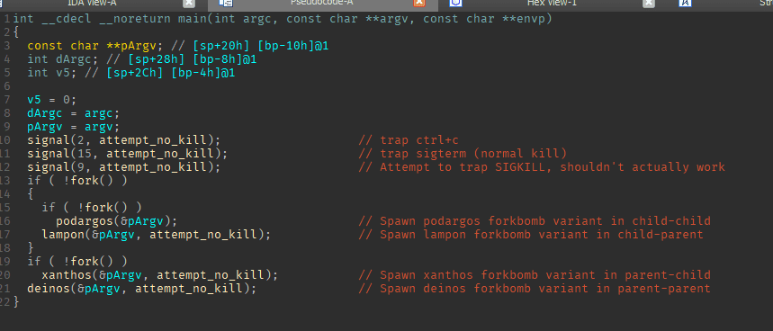
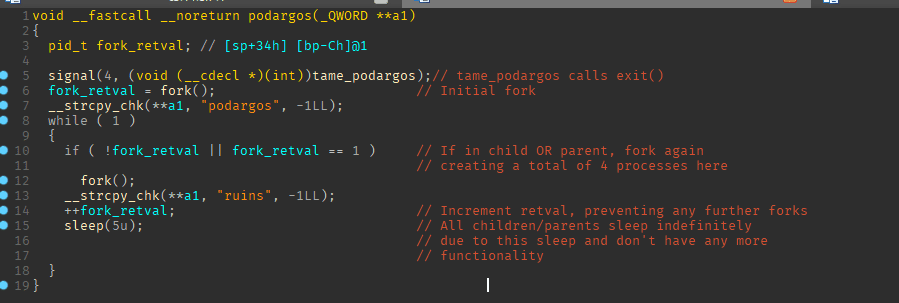
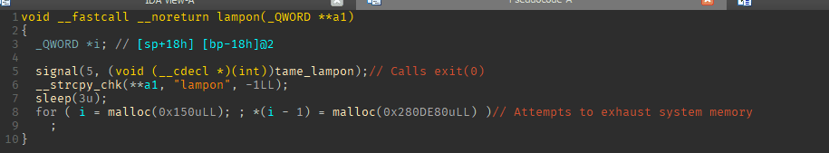
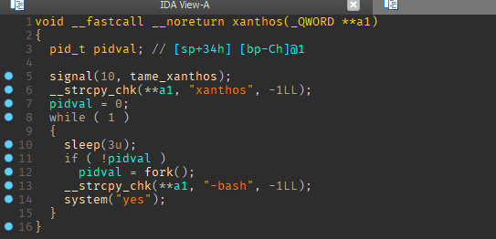
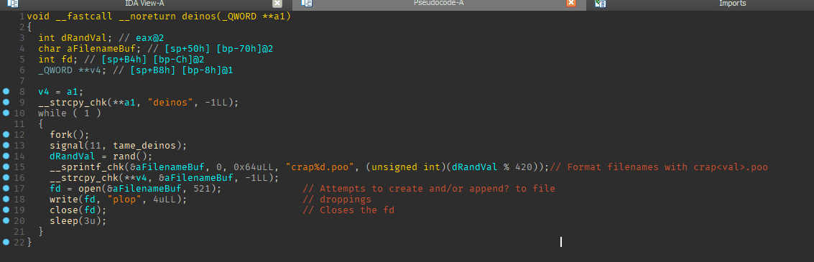

# Labour 07: Mares of Diomedes
**Goal**  
For this labour you will release a dangerous pack of Mares, then steal them for King Eurystheus.

**Mandatory**  
*Create a script*  
    This script runs the included binary called manger, then stops the horses.

*Be creative*  
    try to find as many ways to stop the different steeds as you can.

*Recreate your own manger*  
    stealing the ideas and adding your own, to present to King Eurystheus to finish the labour. Make sure you understand the commands you are using! We are trying to learn here after all!

*Share the source code*  
    Don’t be like Diomedes, who will not be showing you his source code  

**_- Note:_** *Something that hercules might not have known in the foreword could be **SIG**nificant*  
**_- Note:_** *What is really inside a binary? What system does it run on?*  
**_- Note:_** *The mares might crash the console session you run them in if not immediately attended*


## **Commands to Run**   

**Start the Script**
```
$ ./mares.sh
```
**Check running processes**
```
$ ps
```
**Get some data on binary**
```
$ hexdump -C ./mares
```

## **Explanation provided by Paras Jha**
By default, the program first attempts to trap certain signals (prevent their normal execution).

It will then fork twice to create 4 main variants of forkbombs, each which has different functionality.



Those 4 variants are called podargos, lampon, xanthos, and deinos.



The first variant, podargos, traps signal 4 aka SIGTERM with a signal handler that calls exit(0); therefore, you can "tame" the podargos variant by sending SIGTERM to the processes.



lampon needs kill signal 5. lampon attempts to allocate tons of memory, but it shouldn't be an issue since it will only get virtual memory (edited)
Well actually it will eat some physical memory on your system because they attempt to write to the end of every block of memory. But it's not too bad



xanthos takes signal 10 to "tame" it (edited)
xanthos keeps trying to fork and run the system command "yes", probably closest version of an actual forkbomb so far



The Last variant deinos is the one that creates a bunch of files on your system named "crap<val>.poo". Also appears to fork indefinitely

Binary decompiled using:  
https://www.hex-rays.com/products/ida/