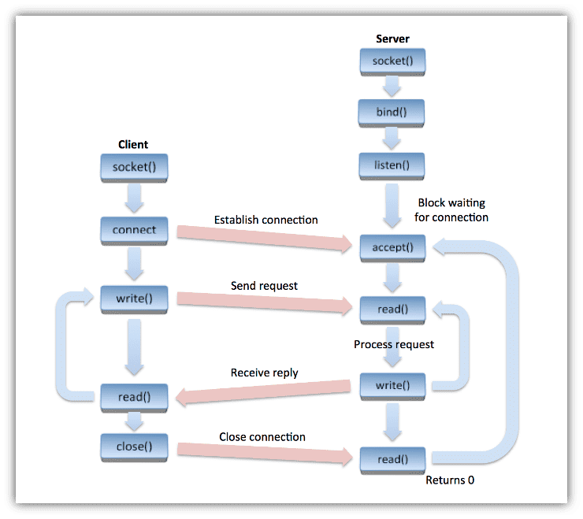
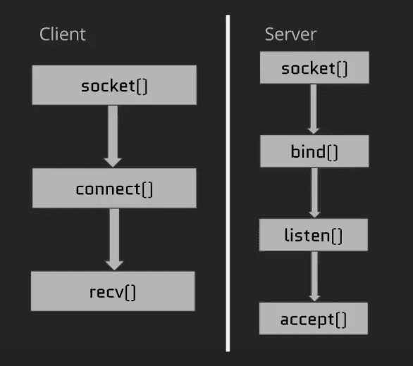

# Labour 11: Capture of Cerberus
**Goal**  
Program a proxy for Hercules! Learn about proxies. Use your C programming skills, and what you learn to recreate one.

**Mandatory**  
Turn in a working proxy, with source code, passing norminette. Error checking must be logical and helpful. You must not use a library or a system call to a pre-built proxy

## **Commands to Run**   
**_- Not Released yet_**
<!-- **Run Benchmark using Wizard**
```
$ python3 siege.py
```
**Run Benchmark using Flags**
```
$ python3 siege.py -u http://google.com -c 100 -r 10
```
**Note:**
- **-u:** *url to benchmark*   
    *(default: http://23.23.42.188)*
- **-c:** *number of clients/threads to use*  
    *(default: 100)*
- **-r:** *number of requests per client*  
    *(default: 5)*  

**Usage**
```
usage: siege.py [-h] [-u url] [-c clients] [-r requests]

Simple http load tester and benchmarking utility

optional arguments:
  -h, --help   show this help message and exit
  -u url       url/website benchmark will be used on
  -c clients   number of clients/threads
  -r requests  number of requests per clients
``` -->


# TCP Sockets
- Sockets are the basic building block of network communication. They are how we connect to things on the internet.

- Sockets sit underneath all of the common internet protocals (http, tcp, etc...) that we use.

- Most of our common networking tasks rely on the TCP protocol for communication (e.g. web browsing)

- We can communicate accross a network with connection streams via sockets.

- HTTP (our web protocol) simply works on top of this TCP workflow, and sends additiional data that the protocol specifies.

### Socket Workflow

### Sockets in C
  
